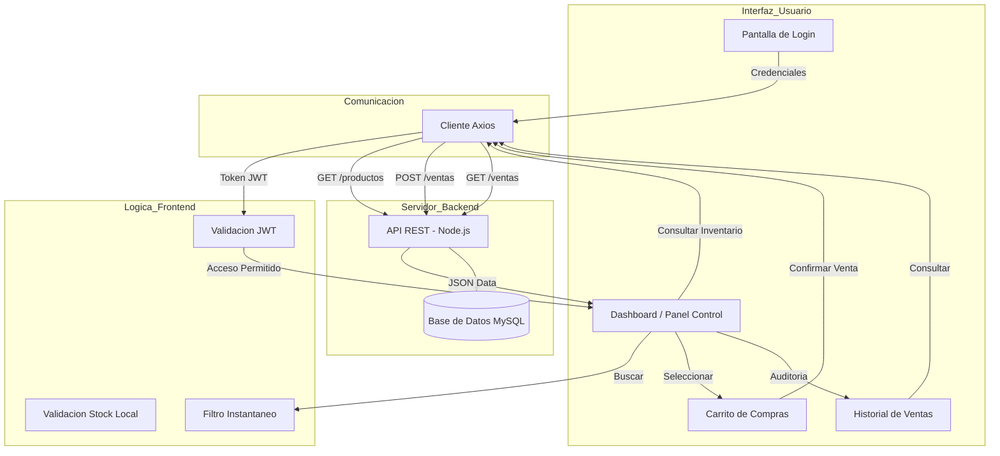

# Nova Salud Sync - Frontend

Interfaz de usuario moderna y agil para la gestion de la botica Nova Salud. Desarrollada como una Single Page Application (SPA) para garantizar velocidad y eficiencia en el mostrador.

## Descripcion

Este proyecto es el cliente web del sistema Nova Salud Sync. Permite a los tecnicos de farmacia buscar medicamentos por nombre o codigo de barras, gestionar un carrito de compras dinamicamente y recibir alertas visuales de productos que requieren reposicion inmediata.

## Tecnologias utilizadas

- React.js: Framework de interfaz de usuario.
- Vite: Herramienta de construccion y servidor de desarrollo.
- Axios: Gestion de peticiones asincronas a la API.
- Lucide React: Kit de iconos vectoriales.
- Vanilla CSS: Estilos personalizados con enfoque en diseño Glassmorphism y UX moderna.

## Instalacion

1. Navegar a la carpeta del frontend.
2. Instalar las dependencias necesarias:
   npm install

## Configuracion

Asegurarse de que el backend este en ejecucion. Por defecto, el frontend esta configurado para conectarse a http://localhost:3000/api a traves de Axios.

## Ejecucion

Para iniciar el servidor de desarrollo:
npm run dev

La aplicacion se abrira por defecto en http://localhost:5173

## Funcionalidades principales

- Panel de Control (Dashboard): Visualizacion general del inventario y alertas.
- Buscador Inteligente: Filtrado instantaneo por diversos criterios.
- Gestion de Ventas: Carrito de compras con edicion de cantidades y eliminacion de items.
- Historial de Auditoria: Consulta detallada de ventas pasadas y productos incluidos.
- Alertas de Stock: Notificaciones visuales basadas en el stock minimo configurado.

## Flujo de Funcionamiento

El siguiente diagrama detalla como interactua el usuario con la interfaz y como esta se comunica con el servidor central:

